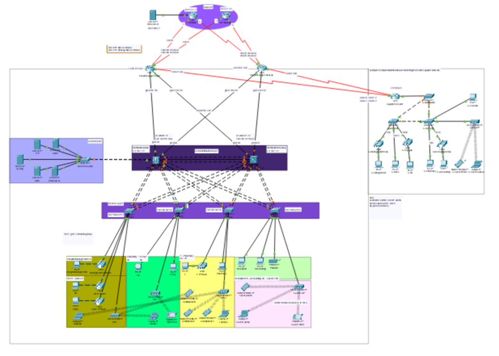

# DEPI Hospital Network Design

Welcome to the **DEPI Hospital Network Design Project** repository! This project demonstrates a highly redundant network design for a hospital, focusing on robust connectivity, efficient traffic management, and secure communication. 

The network is implemented using **Cisco Packet Tracer**, incorporating a wide range of **CCNA** concepts and some **CCNP ENCOR** advanced protocols.

---

## About the Project

This project was developed as part of the **DEPI Technical Program** for the Cisco Network Administration track. It reflects the knowledge gained in:
- **CCNA**: Comprehensive study of foundational networking protocols and configurations.
- **CCNP ENCOR**: Advanced enterprise networking techniques.

---

## Overview

This repository contains the hospital's network design aimed at ensuring **high availability**, **scalability**, and **fault tolerance**. The design includes redundant devices and configurations, meeting the critical demands of a hospital environment.

---

## Key Features

### 1. **High Redundancy**
- Redundant switches and routers for minimized downtime.
- Multiple failover mechanisms for critical links.

### 2. **Network Segmentation**
- VLANs for secure and efficient data separation.
- Segmented traffic for different hospital departments.

### 3. **CCNA Protocols Implemented**
- VLAN, Inter-VLAN routing.
- Spanning Tree Protocol (STP) for loop prevention.
- Routing protocols: OSPF (single area and inter-area).
- DHCP and NAT for efficient IP management.

### 4. **CCNP Topics Included**
- OSPF routing for improved scalability in future work.
- Usage of VTP (VLAN Trunking Protocol) and its disabling after configuration to follow security best practices.
- HSRP (Hot Standby Router Protocol) for gateway redundancy.

### 5. **Other Features**
- Security configurations and best practices for the hospital network.
- Access Control Lists (ACLs) for secure traffic filtering.
- Optimized routing and switching designs.

---

## Repository Contents

- **`DEPI_Hospital_Network.pkt`**: The Cisco Packet Tracer file for the hospital network design.
- **Documentation/**: Additional information about the network topology and configurations.
  - **`Network_Diagram.png`**: Visual representation of the topology.
  - **`Protocols_Used.pdf`**: Explanation of the implemented protocols.
- **README.md**: This file.

---

## Tools Used

- **Cisco Packet Tracer**: For network simulation and design.
- **CCNA & CCNP Concepts**: For theoretical foundation and practical implementation.

---

## How to Use

1. Download the `DEPI_Hospital_Network.pkt` file.
2. Open it in **Cisco Packet Tracer** (Version 8.2.2 or later).
3. Explore the topology, configurations, and test the redundancy, protocols, and security features.

---
